<div align="center">


# DevQA

### Understand your Spring Boot project before it reaches QA.

Repository intelligence inside IntelliJ IDEA.<br />
Discover application layers, inspect Java components, and explore your project from one workspace.

<p>
  
  
  
  
</p>

**[Explore the screenshots](#product-tour) · [Read the feature guide](docs/FEATURES.md) · [Watch the demo](https://www.linkedin.com/posts/ahmedramadanmohamedsmaha_java-springboot-intellijidea-activity-7503421471629762560-otMz)**

</div>

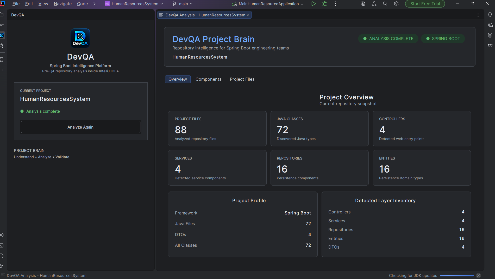

<p align="center"><sub>Completed Project Brain analysis of <strong>HumanResourcesSystem</strong>, a sample Spring Boot application. All metrics shown belong to this example.</sub></p>

> **Current milestone:** Project Brain is under testing and validation. This repository is the public product showcase; the production source code is maintained privately.

## Contents

- [Why DevQA](#why-devqa)
- [Project Brain](#project-brain)
- [Product tour](#product-tour)
- [Example analysis](#example-analysis)
- [Technology](#technology)
- [Roadmap](#roadmap)
- [Availability](#availability)
- [Documentation](#documentation)
- [Feedback and author](#feedback-and-author)

## Why DevQA

Understanding an unfamiliar Spring Boot repository often starts with navigating packages, locating application layers, and checking which resources belong to the project. DevQA brings that first inspection into a dedicated IntelliJ IDEA workspace.

Its first module, **Project Brain**, turns a repository scan into a structured overview: what the project contains, which components were detected, and how its files are grouped. Developers can use that overview to orient themselves before a code review, a change, or a QA handoff.

The broader product vision is to build on this foundation with architecture, quality, and testing intelligence. The current milestone focuses on **repository understanding**.

## Project Brain

Project Brain combines a project overview, a component inventory, and a file explorer in one analysis workspace.

| Capability | What the current showcase presents | How it helps |
| --- | --- | --- |
| **Project overview** | File and Java type counts, framework identification, and detected layer totals | Establish an initial repository snapshot |
| **Component inventory** | Controllers, Services, Repositories, Entities, and DTOs | Review the detected application layers |
| **Java type inventory** | An All Classes view with fully qualified type names | See types in their package context |
| **Project file discovery** | Source, test, resource, configuration, SQL, and documentation entries | Inspect assets beyond Java components |
| **IDE workflow** | A DevQA tool window, visible analysis status, and a dedicated results tab | Run and revisit the analysis inside IntelliJ IDEA |

**Analysis complete** means the repository scan has finished. It does not indicate that tests have passed or that the application has passed a quality or security review. See the [feature reference](docs/FEATURES.md) for scope and interpretation details.

## Product tour

The following tour shows the existing demonstration build. It assumes DevQA is already available in the IDE; distribution details are covered under [Availability](#availability).

### 1. Open DevQA and analyze the repository

1. Open a Spring Boot project in IntelliJ IDEA.
2. Select **View → Tool Windows → DevQA**.
3. Confirm the current project and select **Analyze Repository**.
4. Wait for **Analysis complete**, then explore the **DevQA Analysis** editor tab.
5. Select **Analyze Again** when you want to run another scan.

<details>
<summary><strong>View the workflow — launch, ready state, and analysis in progress</strong></summary>

**Open the tool window**

DevQA is available from the IDE's Tool Windows menu.

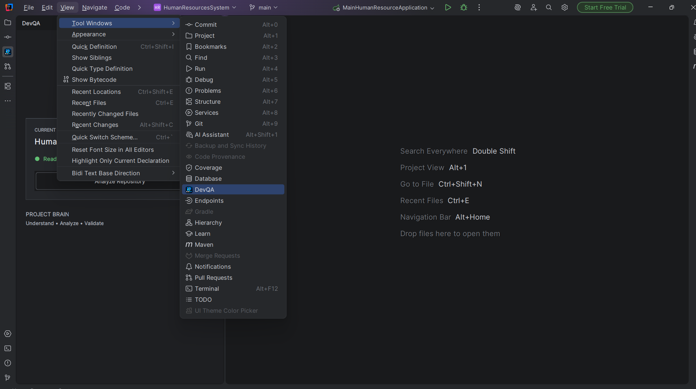

**Start the analysis**

The tool window displays the current project, its Ready status, and the Analyze Repository action.

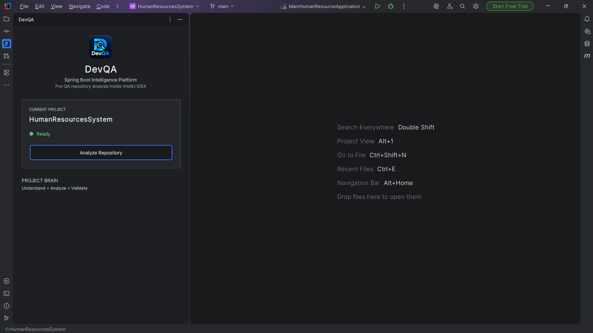

**Follow the analysis state**

The status changes to Analyzing repository while the scan is in progress.

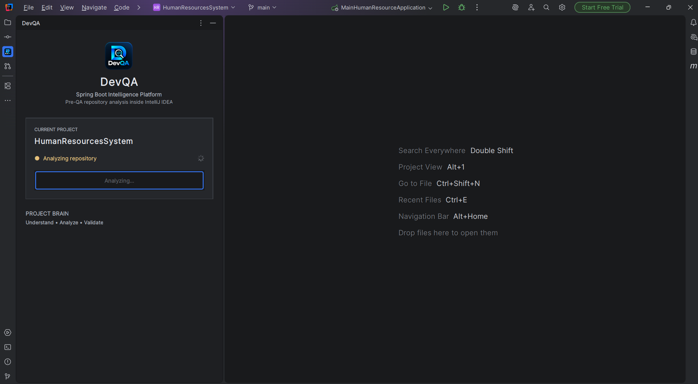

</details>

### 2. Review the project overview

The **Overview** tab brings together six headline metrics, a project profile, and a detected layer inventory. The dashboard at the top of this page shows this completed analysis view.

The profile identifies the sample as **Spring Boot** and summarizes its Java files, DTOs, and discovered classes. The layer inventory lists the detected Controllers, Services, Repositories, Entities, and DTOs.

### 3. Explore application components

The **Components** tab organizes the analysis into six views. Each view displays its own count, making it easy to move between application layers and the Java type inventory.

<details>
<summary><strong>Controllers — detected web-layer components</strong></summary>

The sample contains four detected controllers, including `EmployeeController` and `JobPositionController`.

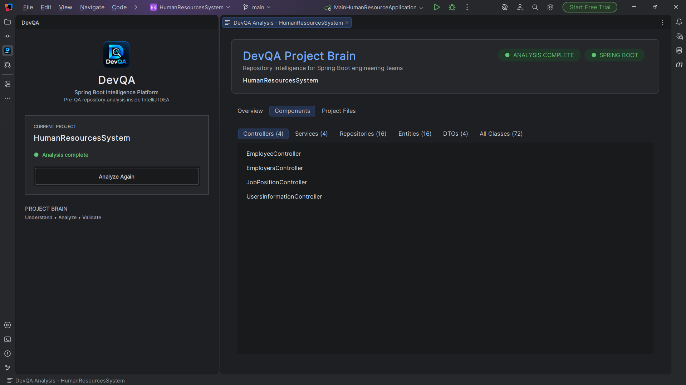

</details>

<details>
<summary><strong>Services — detected service components</strong></summary>

Review the service inventory, including `EmployeeService` and `UsersInformationService`.

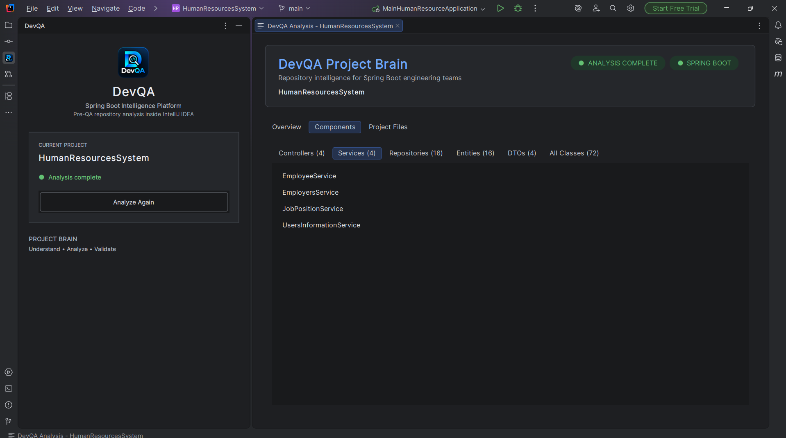

</details>

<details>
<summary><strong>Repositories — persistence components</strong></summary>

Inspect the detected repository types. Here, Repositories refers to application persistence components, such as `CompanyRepository` and `EmployeeRepository`.

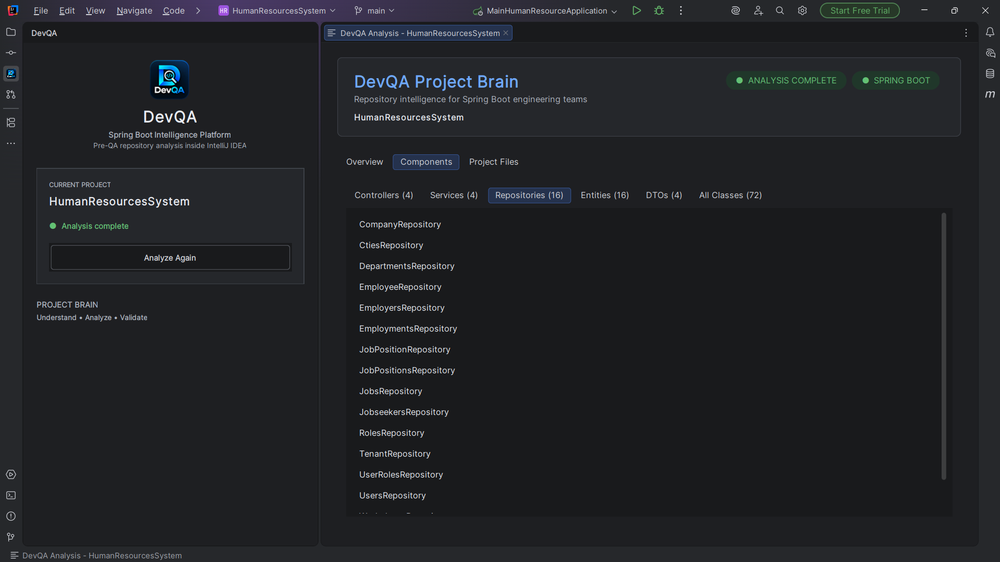

</details>

<details>
<summary><strong>Entities — persistence domain types</strong></summary>

Explore the detected entity inventory, including `EmployeeEntity`, `CompaniesEntity`, and `TenantEntity`.

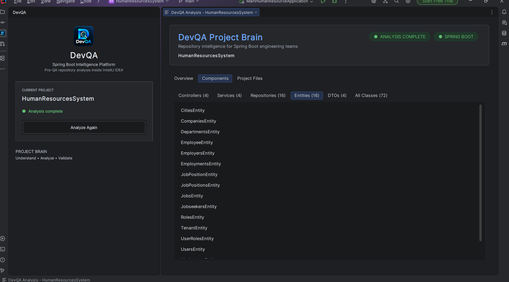

</details>

<details>
<summary><strong>DTOs — data transfer objects</strong></summary>

The sample's detected DTO inventory includes `EmployersDTO`, `JobPositionDTO`, `TenantDTO`, and `UserInformationDTO`.

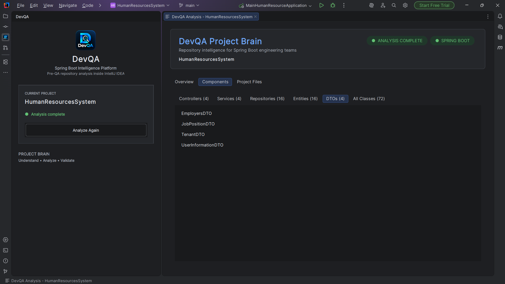

</details>

<details>
<summary><strong>All Classes — Java types with package context</strong></summary>

Fully qualified names retain package context. The captured view abbreviates the list with **“… 47 more classes”**; the displayed total is 72.

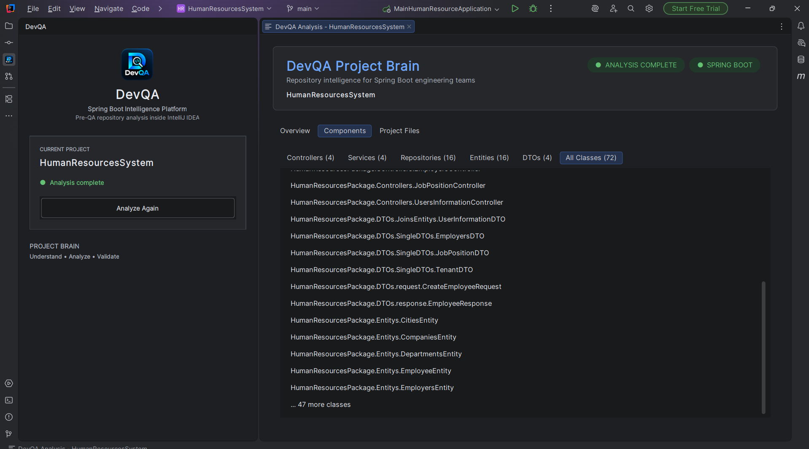

</details>

### 4. Inspect project files

The **Project Files** tab groups discovered files into **Main**, **Test**, **Resource**, and **Unknown**, with file-type subgroups such as Java Source, Properties, SQL, Maven, YAML, and Documentation.

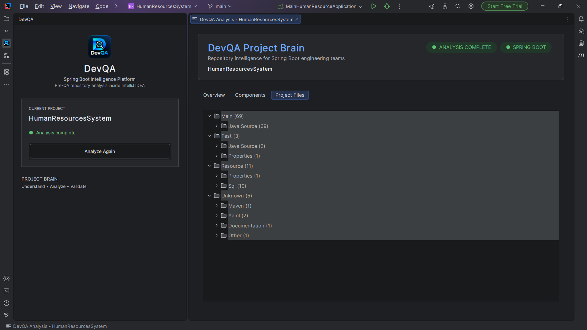

The **Unknown** category still contains file-type subgroups, including Maven, YAML, and Documentation. See the [annotated showcase guide](docs/SHOWCASE.md) for the captured breakdown.

## Example analysis

All 11 screenshots show the same demonstration project: **HumanResourcesSystem**. These are values displayed in that example, rather than benchmarks or fixed limits.

| Dashboard metric | Displayed value |
| --- | ---: |
| Project files | 88 |
| Java classes | 72 |
| Controllers | 4 |
| Services | 4 |
| Repositories | 16 |
| Entities | 16 |
| DTOs | 4 |

The component categories are views of the discovered project, so their counts should not be added to the total class count. Metrics reflect the current detection and classification behavior, which remains under validation. The [showcase guide](docs/SHOWCASE.md#reading-the-example-counts) explains the visible file-count discrepancy between views.

## Technology

The project's documented implementation direction uses:

| Technology | Role |
| --- | --- |
| **Kotlin** | Plugin implementation language |
| **IntelliJ Platform SDK** | IDE integration and plugin infrastructure |
| **IntelliJ PSI APIs** | Java source inspection and program structure access |
| **Swing / IntelliJ UI components** | Tool window and analysis interface |
| **Spring Boot analysis engine** | Repository discovery and component classification |

The implementation is maintained privately. This showcase documents the product experience and technology direction; it does not include build scripts or source-level architecture documentation.

## Roadmap

**Now — Project Brain:** testing the repository analysis experience, validating classification accuracy, and refining the foundation for future modules.

The product vision spans **30+ planned features** across these areas:

| Planned area | Intended direction |
| --- | --- |
| Architecture intelligence | Support understanding of application structure and design |
| Dependency intelligence | Improve visibility into relationships and dependencies |
| Code quality and security analysis | Surface findings for engineering review |
| Testing intelligence | Support test planning and quality workflows |
| AI explanations and fix recommendations | Make future findings easier to understand and act on |
| Project health scoring | Summarize future analysis signals |
| CI/CD integration | Extend analysis into delivery workflows |

These areas describe future development intent. They are separate from the current Project Brain demonstration, and no delivery dates are announced here.

## Availability

| Item | Current status |
| --- | --- |
| Public repository | Documentation, screenshots, and product demonstrations |
| Project Brain | Under testing and validation |
| Production source code | Maintained privately |
| Installable plugin package | No public release is currently published in this repository |
| IDE version compatibility | Not specified in this showcase |

Cloning this repository provides the showcase material. Installation and build instructions are not available here.

For a product walkthrough, [watch the LinkedIn demonstration](https://www.linkedin.com/posts/ahmedramadanmohamedsmaha_java-springboot-intellijidea-activity-7503421471629762560-otMz).

## Documentation

| Resource | What you will find |
| --- | --- |
| [Feature reference](docs/FEATURES.md) | Current capabilities, metric definitions, and analysis scope |
| [Annotated showcase](docs/SHOWCASE.md) | A guided walkthrough of the 11 screenshots and the example dataset |
| [Asset index](assets/README.md) | Branding, screenshot inventory, and original file mapping |

```text
DevQAReview/
├── README.md                         # Product overview and visual tour
├── docs/
│   ├── FEATURES.md                   # Capability reference
│   └── SHOWCASE.md                   # Annotated demonstration
└── assets/
    ├── README.md                     # Asset index and screenshot mapping
    ├── devqa.png                     # Product logo
    └── screenshots/                   # 11 original product screenshots
```

## Feedback and author

Feedback on the showcased workflow, component classification, and documentation is welcome through [GitHub Issues](https://github.com/AhmedRmadanMohamed/DevQAReview/issues). When describing an analysis issue, include the relevant view, the expected result, the observed result, and a minimal example or screenshot that illustrates it.

**Ahmed Ramadan Mohamed** · [GitHub](https://github.com/AhmedRmadanMohamed) · [LinkedIn demo](https://www.linkedin.com/posts/ahmedramadanmohamedsmaha_java-springboot-intellijidea-activity-7503421471629762560-otMz)

---

<p align="center"><strong>DevQA · Understand • Analyze • Validate</strong></p>
